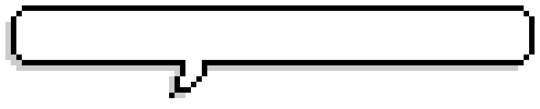

<div align="center">
  <a href="https://github.com/Jasonli1991">
    
  </a>
</div>
<!-- <h1 align="center" class="animated">👋 Hi there</h1> -->

<h2>👋 I'm Jason, </h2>
<h3>a passionate and constantly learning full-stack developer from Taiwan!</h3>

<p><a href="https://github.com/Jasonli1991"></a></p>

- 🔭 I'm currently studying **programimg.**

- 🌱 I’m currently learning **Java, Swift.**

- 🎮 I’m looking to collaborate on **electronic tabletop games.**

- 🤝 I’m looking for help with **websoket.**

- 📫 You can reach me at **chih.chung.li.1991@gmail.com**

<br>
<h3 align="left">Languages and Tools:</h3>
<p align="left"> <a href="https://getbootstrap.com" target="_blank" rel="noreferrer">  </a> <a href="https://git-scm.com/" target="_blank" rel="noreferrer">  </a><a href="https://www.java.com" target="_blank" rel="noreferrer">  </a><a href="https://www.w3schools.com/css/" target="_blank" rel="noreferrer">  </a><a href="https://www.w3.org/html/" target="_blank" rel="noreferrer">  </a> <a href="https://developer.mozilla.org/en-US/docs/Web/JavaScript" target="_blank" rel="noreferrer">  </a>   <a href="https://www.mysql.com/" target="_blank" rel="noreferrer">  </a> <a href="https://nodejs.org" target="_blank" rel="noreferrer">  </a> <a href="https://www.python.org" target="_blank" rel="noreferrer">  </a> <a href="https://spring.io/" target="_blank" rel="noreferrer">  </a> <a href="https://www.photoshop.com/en" target="_blank" rel="noreferrer">  </a> 
  <a href="https://www.adobe.com/in/products/illustrator.html" target="_blank" rel="noreferrer">  </a></p>


<p><a href="https://github.com/Jasonli1991"></a></p>

<p><a href="https://github.com/Jasonli1991"></a></p>
<div align="left" width="70%">

```javascript
const me = {
  name: 'Jason Li',
  pronouns: [ 'he', 'him' ],
  stack: {
    languages: [ 'JavaScript', 'jQuery', 'Java', 'Python' ],
    frontend: [ 'HTML5', 'CSS3', 'BootStrap', 'Vue' ],
    backend: [ 'Node', 'mySQL' ],
  },
  code (caffeine) {
    console.log('🐶☕️ Refueling...');
    while (caffeine > 0) {
      console.log('💻🪄 Magic!');
      caffeine--;
    }
    console.log('🪫💤 Out of fuel!');
  },
};
```

</div>

<h3 align="left">Connect with me:</h3>
<p align="left">
<a href="https://instagram.com/chih_chung_li" target="blank"></a>
<a href="https://discord.gg/Jasonli#1236" target="blank"></a>
</p>


<p><a href="https://github.com/Jasonli1991"></a></p>
<!-- # README -->

<!-- 
 -->


| <div align="center"><a href="https://github.com/Jasonli1991-readme-stats"></a> | <a href="https://github.com/Jasonli1991-readme-stats"></a> </div>|
| ------------- | ------------- |


