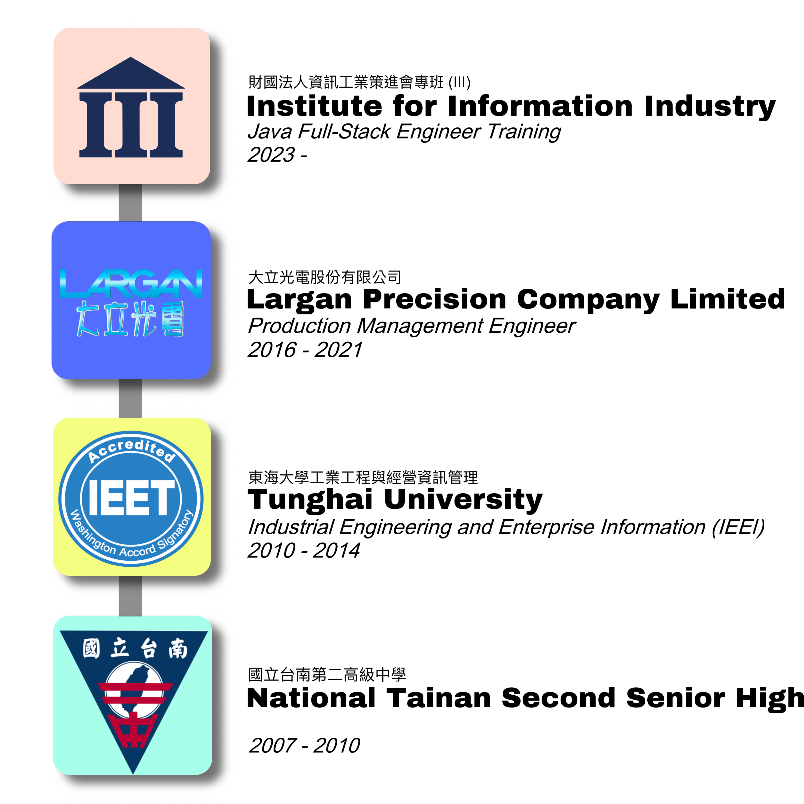

<div align="left">
  <a href="https://github.com/Jasonli1991"></a>
</div>

<h2>👋 I'm Jason,
  <a href="https://github.com/Jasonli1991"></a>&nbsp;
  <a href="https://github.com/Jasonli1991"></a>
  <a href="https://github.com/Jasonli1991"></a>
  <a href="https://github.com/Jasonli1991"></a>
  <a href="https://github.com/Jasonli1991"></a>
  <a href="https://github.com/Jasonli1991"></a>
  <a href="https://github.com/Jasonli1991"></a>
  <a href="https://github.com/Jasonli1991"></a>
  <a href="https://github.com/Jasonli1991"></a>
</h2>

<table><tr>
<td valign="top" width="65%">

<h3>⚡ Forward Deployed Engineer & AI Solutions Architect from Taiwan 🇹🇼</h3>

- 🚀 Currently working as **Forward Deployed Engineer** @ [Dash-U Tech](https://github.com/DashU-7UP)
- 🤖 Building **production-grade AI pipelines** with LangChain, RAG & Ollama
- 🏭 Fun fact: ex-factory supervisor → software engineer — I bridge **human needs & tech**
- 🌱 Deep-diving into **advanced RAG architectures & LLM applications**
- 🤝 Open to collaborate on **AI-powered apps & complex system integrations**
- 📫 Reach me at **jason@dash-u.email**

</td>
<td valign="top" width="35%" align="center">


</td>
</tr></table>

---

<h3 align="left">🛠️ Languages and Tools:</h3>

           

<a href="https://github.com/Jasonli1991"></a>

<table><tr>
<td valign="top" width="55%">

```javascript
const me = {
  name    : 'Jason Li',
  role    : 'Forward Deployed Engineer',
  location: 'Taichung, Taiwan',
  stack: {
    ai      : ['LangChain', 'RAG', 'Ollama', 'Vector DB'],
    backend : ['FastAPI', 'Python', 'Spring Boot', 'Java'],
    infra   : ['Docker', 'Kubernetes', 'PostgreSQL', 'CI/CD'],
    frontend: ['React', 'TypeScript', 'Vue.js', 'Tailwind']
  },
  experience: '5+ years · 45+ projects',
  superpower: '工廠監工 → AI 工程師，聽得懂老闆在說什麼的開發者',
  build (problem) {
    while (problem.isAmbiguous) problem = clarify(problem);
    return ship({ quality: 'production-grade' });
  }
};
```

</td>
<td valign="top" width="45%" align="center">



</td>
</tr></table>

---

<h3 align="left">📱 Connect with me:</h3>

<a href="https://www.linkedin.com/in/jason-li-691325118" target="blank"></a>
<a href="https://instagram.com/jasonli.json" target="blank"></a>

<a href="https://github.com/Jasonli1991"></a>

<div align="center">
  
  &nbsp;
  
</div>