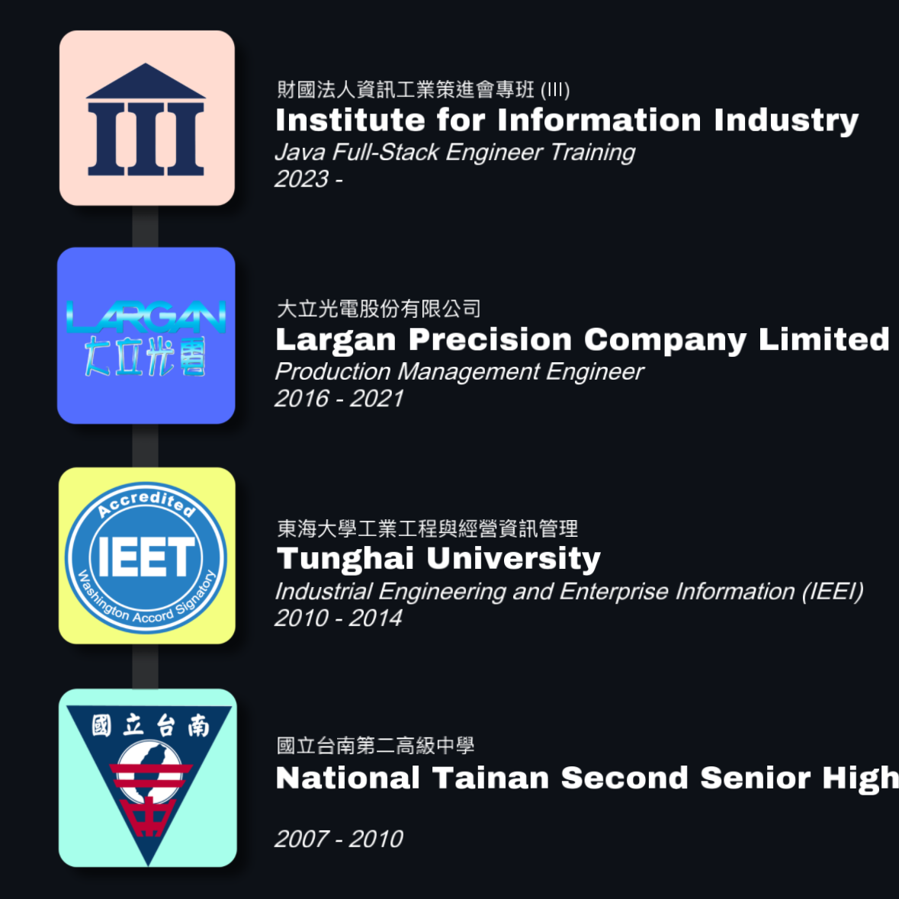

<div align="left">
  <a href="https://github.com/Jasonli1991">
    
  </a>
</div>

<h2>👋 I'm Jason,
  <a href="https://github.com/Jasonli1991"></a>&nbsp;
  <a href="https://github.com/Jasonli1991"></a>
  <a href="https://github.com/Jasonli1991"></a>
  <a href="https://github.com/Jasonli1991"></a>
  <a href="https://github.com/Jasonli1991"></a>
  <a href="https://github.com/Jasonli1991"></a>
  <a href="https://github.com/Jasonli1991"></a>
  <a href="https://github.com/Jasonli1991"></a>
  <a href="https://github.com/Jasonli1991"></a>
</h2>

<h3>⚡ Forward Deployed Engineer & AI Solutions Architect from Taiwan 🇹🇼</h3>

<p><a href="https://github.com/Jasonli1991"></a></p>

- Forward Deployed Engineer @ [Dash-U Tech](https://github.com/DashU-7UP)

- Working mostly on AI integrations — LangChain, RAG, Ollama

- Came from manufacturing, now write code. Still figuring things out.

- Currently learning how to build things that actually work in production

- 📫 jason@dash-u.email

<br>

<h3 align="left">🛠️ Languages and Tools:</h3>

<a href="https://skillicons.dev">
  
</a>
<br>
<a href="https://skillicons.dev">
  
</a>

<p><a href="https://github.com/Jasonli1991"></a></p>

<p><a href="https://github.com/Jasonli1991#gh-light-mode-only"></a></p>
<p><a href="https://github.com/Jasonli1991#gh-dark-mode-only"></a></p>

<div align="left" width="70%">

```javascript
const me = {
  name    : 'Jason Li',
  role    : 'Forward Deployed Engineer',
  location: 'Taichung, Taiwan',
  stack: {
    ai      : ['LangChain', 'RAG', 'Ollama', 'Vector DB'],
    backend : ['FastAPI', 'Python', 'Spring Boot', 'Java'],
    infra   : ['Docker', 'Kubernetes', 'PostgreSQL', 'CI/CD'],
    frontend: ['React', 'TypeScript', 'Vue.js', 'Tailwind']
  },
  experience: '5+ years · 45+ projects',
  superpower: 'ex-factory supervisor who speaks both human and code',
  build (problem) {
    console.log('🔍 Diagnosing requirements...');
    while (problem.isAmbiguous) {
      problem = clarify(problem);
    }
    return ship({ solution: problem, quality: 'production-grade' });
  }
};
```

</div>

<h3 align="left">📱 Connect with me:</h3>

<a href="https://www.linkedin.com/in/jason-li-691325118" target="blank">
  
</a>
<a href="https://instagram.com/jasonli.json" target="blank">
  
</a>
<a href="mailto:jason@dash-u.email">
  
</a>
